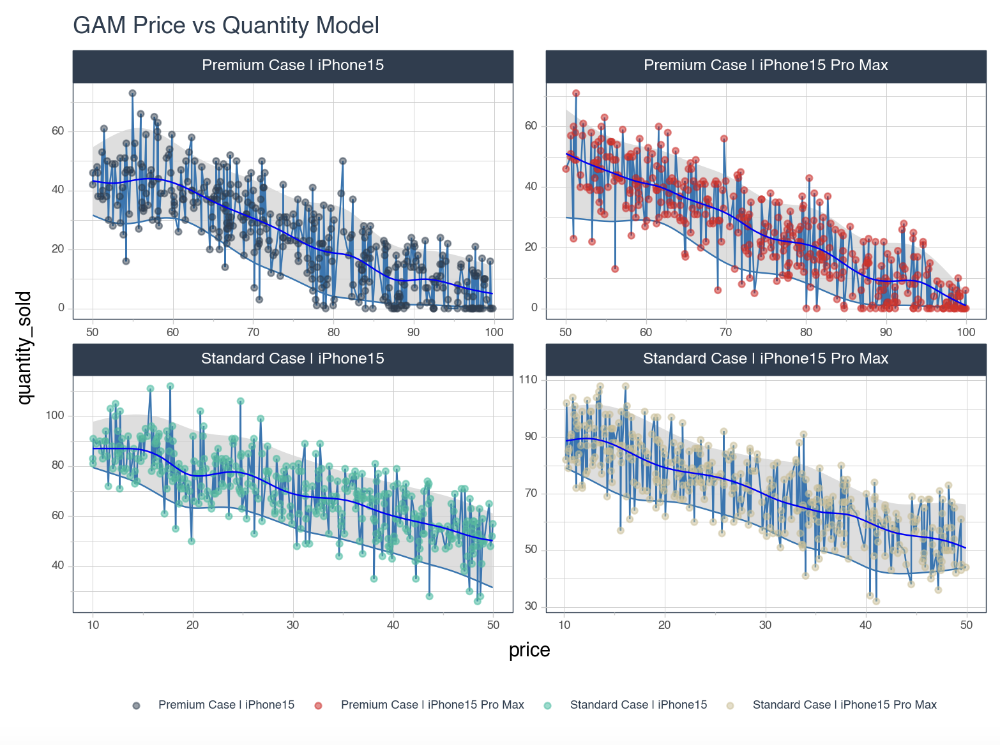
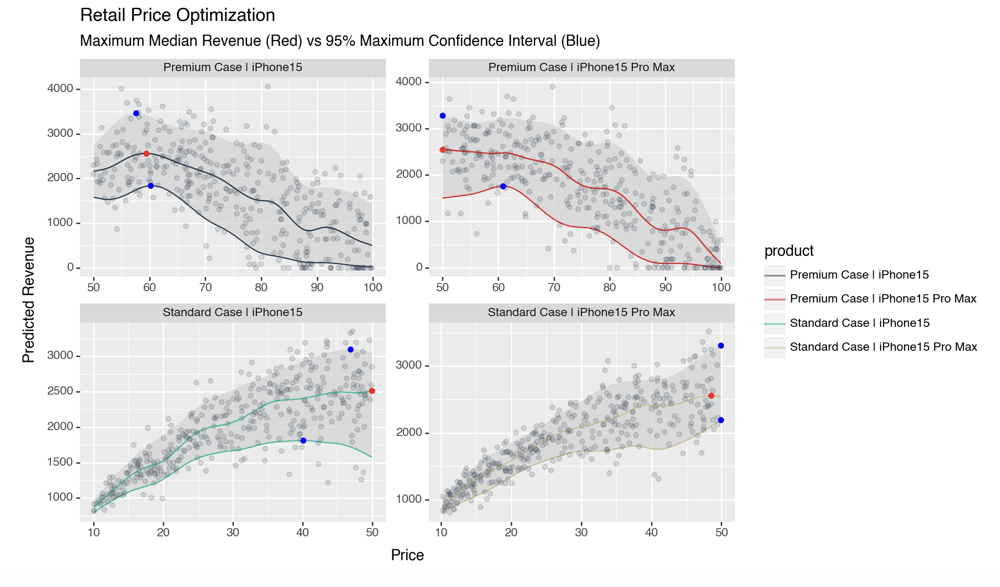

# Price Optimization Using PyGAM

This project explores the use of Generalized Additive Models (GAMs) for price optimization in retail scenarios. It consists of two main notebooks:

1. `exploringPyGAM.ipynb`: A primer on Expectile GAM for price optimization
2. `priceElasticityOfDemandUsingPyGAM.ipynb`: Application of GAMs to analyze price elasticity of demand

## exploringPyGAM.ipynb

This notebook showcases the use of Expectile GAM as a primer for price optimization.

## priceElasticityOfDemandUsingPyGAM.ipynb

This notebook applies GAMs to analyze the price elasticity of demand using a more complex dataset.

### Data

The notebook uses a dataset with the following characteristics:

- Products: Standard and Premium cases for iPhone 15 and iPhone 15 Pro Max
- Events: No Promo, Black Friday, New iPhone, Christmas, The Big Game
- Price: 
  - Standard cases: $10 - $50
  - Premium cases: $50 - $100
- Quantity sold

### Usage

The data is imported from a CSV file named 'retail_price.csv' as a dataframe for further analysis.

## Conclusion

These notebooks provide a comprehensive approach to analyzing price elasticity and optimizing pricing strategies using Generalized Additive Models. The techniques demonstrated can be applied to real-world retail scenarios for more effective pricing decisions.

## Results

